# 🧭 StandupPilot

> **Voice-enabled stand-up copilot**
> Turn a spoken, ticket-specific update into an evidence-backed Jira proposal—then require
> explicit human approval and Jira verification before any status can change.

**The model proposes. It never writes to Jira.**

StandupPilot is a local, browser-assisted MVP for teams using Google Meet and Jira. A
Chrome caption bridge forwards finalized Meet captions to a local FastAPI service.
Relevant statements are interpreted through OpenRouter, reconciled with live Jira data,
and reviewed in Streamlit. An authorized reviewer is the only actor that can approve a
transition.

## ▶️ Demo: spoken update to verified Jira result

1. Start a Google Meet, enable native captions, and start the caption bridge.
2. Say a ticket-specific delivery update, for example: `"PROJ-123 is complete and ready for Done."`
3. StandupPilot records the caption, preserves the displayed speaker label as evidence,
   and identifies the explicit Jira key.
4. It reads the Jira issue and its allowed workflow transitions, then displays a proposal
   with the source text, current status, and proposed target status.
5. An Auth0-authenticated reviewer approves or rejects the proposal in Streamlit.
6. On approval, the action service re-reads Jira, checks that the proposal is still
   valid, executes the allowed transition once, and reads Jira again to verify success.

The Streamlit tab can be shared into Meet with tab audio to present the proposal and the
verified outcome to the meeting.

## Architecture

```mermaid
flowchart LR
    Meet["Google Meet\nNative captions"] --> Bridge["Chrome MV3 caption bridge"]
    Bridge -->|"POST /v1/captions\nX-StandupPilot-Session"| API["FastAPI caption ingress"]
    API --> Store[("PostgreSQL\ncaption + proposal store")]
    Store --> Filter["Ticket-key + delivery-language prefilter"]
    Filter --> Agent["OpenRouter structured interpreter\n(rule-based fallback)"]
    Agent --> JiraRead["Jira reader\nissue + allowed transitions"]
    JiraRead --> Proposal["Evidence-backed proposal"]
    Proposal --> UI["Streamlit review UI"]
    Auth0["Auth0 identity"] --> UI
    UI -->|"authorized approval"| Action["Action service"]
    Action -->|"re-read • transition • re-read"| JiraWrite["Jira Cloud"]
    JiraWrite --> Result["Verified result\nshown / announced in Meet"]
```



### Trust boundaries

- **Google Meet speaker labels are evidence, not identity.** A displayed name never
  grants approval authority.
- **Credentials stay server-side.** Jira, OpenRouter, Auth0, and database credentials
  belong only in the git-ignored `.env`; the extension receives a limited
  meeting-session token.
- **Authentication is not authorization.** Only Auth0 identities in
  `REVIEWER_ALLOWLIST` may approve an action.
- **Jira mutation has one path.** The action service validates freshness and currently
  allowed transitions, executes at most once per proposal, and verifies the resulting
  Jira status before reporting success.

## Quick start

### Prerequisites

- Python 3.11+
- A running local PostgreSQL database
- Google Chrome (for the caption bridge and sharing the Streamlit tab)
- Credentials for OpenRouter, Jira Cloud, and Auth0 for the complete integration demo

### Install and run

```bash
git clone <repository-url>
cd StandupPilot
./scripts/setup.sh
source .venv/bin/activate

# Terminal 1: caption ingress
./scripts/run_api.sh      # http://localhost:8000

# Terminal 2: reviewer UI
./scripts/run_ui.sh       # http://localhost:8501
```

`setup.sh` creates local configuration templates if needed, installs the editable
project and development dependencies, validates the baseline, and runs the shared
contract tests. It does **not** create or manage PostgreSQL—set `DATABASE_URL` to a
database you already run.

See [docs/SETUP.md](docs/SETUP.md) for the full workstation guide.

## Configuration

Copy `.env.example` to `.env` if the setup script has not already done so. Never
commit `.env`.

| Configuration | Purpose |
| --- | --- |
| `DATABASE_URL` | Required PostgreSQL connection; SQLite is intentionally unsupported. |
| `OPENROUTER_API_KEY`, `OPENROUTER_MODEL` | Structured caption interpretation. |
| `JIRA_BASE_URL`, `JIRA_USER_EMAIL`, `JIRA_API_TOKEN` | Jira Cloud access; use an account restricted to the demo project. |
| `JIRA_PROJECT_KEY`, `JIRA_DEMO_ISSUE_KEY` | Fixed project and ticket for the golden-path demo. |
| `AUTH0_DOMAIN`, `AUTH0_CLIENT_ID`, `AUTH0_CLIENT_SECRET` | Reviewer login. Add `http://localhost:8501/oauth2callback` as an Auth0 callback URL. |
| `REVIEWER_ALLOWLIST` | Comma-separated identities that may approve a Jira transition. |

Mirror the Auth0 client settings in
[.streamlit/secrets.toml.example](.streamlit/secrets.toml.example) as instructed in
the setup guide.

## Repository map

| Path | Purpose |
| --- | --- |
| [src/standup_pilot/contracts/](src/standup_pilot/contracts/) | Frozen data models, local ports, endpoint constants, and module protocols. |
| [src/standup_pilot/settings.py](src/standup_pilot/settings.py) | Server-only configuration boundary. |
| [src/standup_pilot/testing/](src/standup_pilot/testing/) | In-memory fakes used while integrations are assembled. |
| [src/standup_pilot/api/](src/standup_pilot/api/) | FastAPI caption-ingress application. |
| [app/](app/) | Streamlit reviewer interface. |
| [extension/](extension/) | Chrome Manifest V3 caption bridge (integration workspace). |
| [migrations/](migrations/) | PostgreSQL migration workspace. |
| [docs/specs/](docs/specs/) | MVP specification and parallel implementation plan. |

Module ownership and integration boundaries are documented in
[docs/OWNERSHIP.md](docs/OWNERSHIP.md).

## Development and verification

```bash
pytest tests/contracts          # shared contract suite
pytest -m "not storage"         # tests that do not need PostgreSQL
pytest                          # full suite (storage tests need PostgreSQL)
ruff check . && ruff format --check .
python scripts/check_setup.py   # workstation readiness report
```

## MVP status and limitations

This repository contains the runnable foundation: frozen contracts, configuration,
FastAPI caption ingress, and a Streamlit application shell. Some end-to-end adapters
remain integration work, including production PostgreSQL persistence, the Chrome
caption bridge, OpenRouter interpretation, Jira Cloud actions, and Auth0 login.

The MVP is intentionally narrow:

- It observes native Google Meet captions; it does not join meetings or capture raw audio.
- It requires an explicit Jira key and delivery language before a statement reaches
  inference.
- It does not treat a Meet display name as a verified person.
- It does not autonomously change Jira; a configured reviewer must explicitly approve.
- A rule-based fallback supports the fixed demo scenario if free-model availability is
  interrupted.

## Further reading

- [Local setup guide](docs/SETUP.md)
- [MVP specification](docs/specs/standup-pilot-mvp-spec.md)
- [Parallel implementation plan](docs/specs/standup-pilot-parallel-implementation-plan.md)
- [Module ownership](docs/OWNERSHIP.md)
