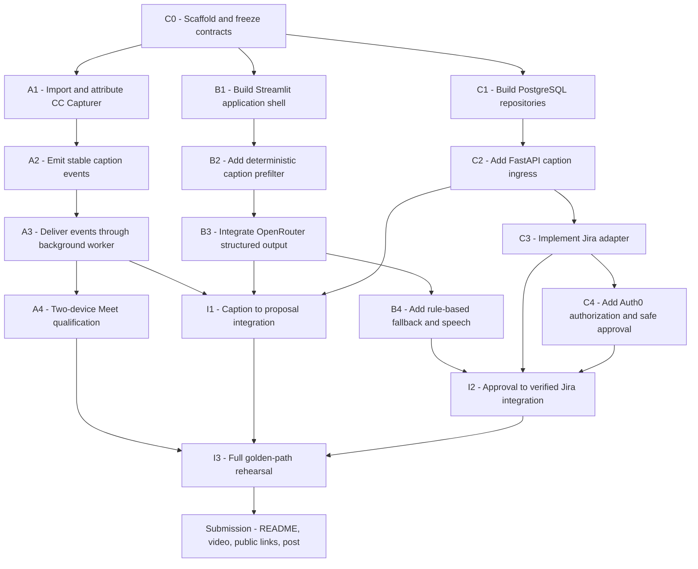

# StandupPilot Parallel Implementation Plan

## Goal

Deliver a working hackathon demonstration in which Google Meet captions create an evidence-backed Jira transition proposal, an Auth0-authenticated reviewer approves it in Streamlit, Jira performs and verifies the transition, and StandupPilot announces the result.

This plan implements the decisions in `standup-pilot-mvp-spec.md`. The implementation is divided among three developers with a single shared-contract checkpoint followed by parallel work on non-overlapping modules.

## Global Constraints

- Preserve the fixed scope: one Google Meet meeting, one Jira project, one explicit ticket key, and one approved status transition.
- Use a modified fork of `https://github.com/yunho0130/google-meet-cc-to-srt` at pinned upstream revision `c7e649ceffde719fd66b319460b62a5ca56df890` for caption input.
- Use Streamlit for the interface and Auth0 OIDC login.
- Use FastAPI for caption ingestion and the installed local PostgreSQL 16 server for shared persistence. Do not add a SQLite fallback.
- Use OpenRouter for model inference with a configurable model and `openrouter/free` as the zero-cost default.
- Do not expose Jira, OpenRouter, Auth0, or database credentials to the Chrome extension or repository.
- The model proposes actions but never performs Jira mutations.
- Jira success is reported only after a post-transition read verifies the target state.
- Each developer owns exclusive modules during the parallel phase.
- Shared contracts change only after all three developers agree.

## Dependency Graph

## Phase 0: Shared Baseline

**Time box:** 20 minutes

**Owner:** Developer B, acting as integration lead. Developers A and C review before the baseline commit.

### Required outcomes

1. Create the Python and extension project scaffolds and dependency manifests without implementing production persistence, caption ingestion, Jira calls, or Auth0 authorization.
2. Create example configuration files with placeholder values and ignore all real secret files.
3. Define and test the shared caption-event, proposal, agent-output, authenticated-reviewer, and action-result contracts.
4. Freeze the caption endpoint as `POST http://localhost:8000/v1/captions`.
5. Freeze the extension authentication header as `X-StandupPilot-Session`.
6. Freeze the Streamlit address as `http://localhost:8501` and FastAPI address as `http://localhost:8000`.
7. Freeze proposal states as pending, approved, rejected, stale, executed, and failed.
8. Define interfaces for caption receipt, caption storage, proposal storage, ticket reads, allowed transitions, reviewer authorization, and approved execution.
9. Supply test doubles for the caption receiver, storage, Jira reads, reviewer identity, and action service so each feature branch can demonstrate its owned behavior without another branch.
10. Provide a minimal Streamlit shell and FastAPI health response only; do not create the production caption route or PostgreSQL migrations in the baseline.
11. Run the contract and shell smoke tests and obtain a passing result.
12. Commit the baseline with `chore: scaffold StandupPilot and freeze integration contracts`.
13. Record the baseline commit hash. All three branches start from this exact commit.

### Branches

- Developer A: `feat/meeting-bridge`
- Developer B: `feat/streamlit-openrouter`
- Developer C: `feat/jira-actions-auth`

## Developer A: Google Meet Caption Bridge

**Owned modules:** Chrome extension and Meet DOM fixtures.

**Must not modify:** Python application, persistence, Jira, authentication, or Streamlit modules.

### A1: Import and attribute the caption project

1. Import Google Meet CC Capturer from `https://github.com/yunho0130/google-meet-cc-to-srt` at revision `c7e649ceffde719fd66b319460b62a5ca56df890` into the extension module.
2. Preserve the upstream copyright and complete license.
3. Add a visible statement that the extension is derived from Google Meet CC Capturer.
4. Add a changelog entry listing all StandupPilot modifications.
5. Load the unmodified extension through Chrome's developer mode.
6. Join a Google Meet call, enable captions, and confirm the upstream capture UI works.
7. Commit with `chore(extension): add attributed Meet caption capturer`.

### A2: Produce the shared caption event

1. Add a test fixture representing finalized captions from two displayed speakers.
2. Write a failing test that expects one shared caption event per completed statement.
3. Verify partial caption updates do not produce separate events.
4. Verify identical text from different speakers remains distinguishable.
5. Implement event construction using the frozen contract.
6. Generate a stable event identifier from the meeting session, speaker, finalized text, and capture time bucket.
7. Retain the upstream stabilization and per-speaker deduplication behavior.
8. Run extension tests and confirm the fixture produces the expected event sequence.
9. Commit with `feat(extension): emit stable StandupPilot caption events`.

### A3: Deliver caption events

1. Add a Manifest V3 background service worker.
2. Add the local FastAPI address to extension host permissions.
3. Send finalized events from the content script to the background worker.
4. Post events from the background worker to the frozen caption endpoint.
5. Add the limited meeting-session token header.
6. Implement a bounded retry queue for timeouts and temporary server failures.
7. Treat duplicate acceptance as success.
8. Display connected, retrying, and disconnected status in the extension.
9. Confirm no application secrets appear in extension source, storage, logs, or requests.
10. Commit with `feat(extension): forward captions to StandupPilot API`.

### A4: Qualify against Google Meet

1. Start the baseline contract receiver and clear its received-event log.
2. Join from two devices with distinct displayed names.
3. Enable captions before speaking.
4. Speak the fixed demo sentence from the second device.
5. Verify the contract receiver receives one finalized event with the correct displayed name.
6. Restart the contract receiver and verify queued delivery resumes without duplicates.
7. Start and stop extension forwarding twice.
8. Record pass or fail evidence for each check.
9. Commit fixes only, using `fix(extension): stabilize live Meet delivery`.

## Developer B: Streamlit and OpenRouter

**Owned modules:** Streamlit application, agent interpretation, rule-based fallback, and speech helper.

**Must not modify:** Extension, PostgreSQL implementation and migrations, FastAPI caption route, Jira transport, or approval execution.

### B1: Build the Streamlit shell

1. Write a smoke test that imports the Streamlit application without performing external calls.
2. Create the application header and meeting-session controls.
3. Add connection and authentication status areas.
4. Add a live transcript region.
5. Add a proposal region containing ticket, current Jira state, target state, evidence, and inference source.
6. Add Approve and Reject controls wired only to the baseline fake action-service and reviewer-identity interfaces; real Auth0 and Jira wiring occurs during integration.
7. Add an action-result region.
8. Refresh the transcript and proposal regions every one second using a Streamlit fragment.
9. Run the smoke test.
10. Commit with `feat(ui): add Streamlit review interface`.

### B2: Add deterministic prefiltering

1. Write tests for explicit Jira keys and delivery phrases.
2. Write tests proving ordinary conversation and captions without Jira keys do not invoke inference.
3. Implement the Jira-key pattern and fixed delivery vocabulary.
4. Ignore events already linked to proposals.
5. Process only one unresolved proposal at a time.
6. Expose an explanation when an event is ignored.
7. Run the focused tests.
8. Commit with `feat(agent): prefilter actionable Jira statements`.

### B3: Integrate OpenRouter

1. Write a fake OpenRouter transport returning a valid structured interpretation.
2. Write tests for invalid JSON, schema violations, timeouts, rate limits, and a returned ticket key that differs from the caption.
3. Configure the API key, model slug, site URL, and application title exclusively through server configuration.
4. Call the OpenRouter chat-completions endpoint with model `openrouter/free` by default and a strict JSON schema request.
5. Set temperature to zero, a short timeout, and at most one retry.
6. Validate the response with the frozen agent-output contract.
7. Reject mismatched ticket keys and unexpected target states.
8. Convert valid output into a pending proposal only after the baseline fake Jira-read interface supplies current state and allowed transitions; the real adapter replaces it during integration.
9. Run focused agent tests.
10. Commit with `feat(agent): create structured proposals through OpenRouter`.

### B4: Add deterministic fallback and speech

1. Write tests showing that fixed, done, and completed language maps to a proposed Done state when OpenRouter is unavailable.
2. Require the same explicit Jira-key prefilter for fallback proposals.
3. Label fallback proposals as rule-based in the UI.
4. Preserve human approval and Jira revalidation for fallback proposals.
5. Add browser speech synthesis for proposal and verified-result text.
6. Ensure spoken and visible text are identical.
7. Set the processing-suppression state while speech is active.
8. Provide manual Speak controls if browser autoplay is blocked.
9. Run focused tests and a browser smoke test.
10. Commit with `feat(ui): add resilient fallback and meeting speech`.

## Developer C: Persistence, Jira, Auth0, and Safe Actions

**Owned modules:** PostgreSQL persistence and migrations, FastAPI caption ingress, Jira adapter, Auth0 configuration, authorization, and action execution.

**Must not modify:** Extension DOM logic, Streamlit layout, or OpenRouter prompt and parser.

### C1: Implement PostgreSQL persistence

1. Confirm the installed PostgreSQL 16 server is accepting connections before creating application objects.
2. Define a server-side `DATABASE_URL` for development and a separate isolated test database or schema.
3. Write repository tests for meeting sessions, caption events, proposals, and action results against PostgreSQL.
4. Verify event identifiers and proposal execution identifiers are unique.
5. Verify duplicate insertion returns the existing record rather than raising an unhandled error.
6. Create versioned migrations for all required tables, constraints, indexes, and proposal-state rules.
7. Use PostgreSQL transactions and row-level concurrency controls where approval or idempotent execution can race.
8. Store application times as UTC `TIMESTAMPTZ` values.
9. Use Psycopg 3, bounded connection pooling, and parameterized SQL for every value.
10. Prove migrations apply cleanly to an empty database and can be checked from a clean checkout.
11. Run storage tests and remove test data afterward.
12. Commit with `feat(storage): persist StandupPilot workflow state in PostgreSQL`.

### C2: Implement FastAPI caption ingress

1. Write API tests for accepted events, invalid bodies, missing tokens, invalid tokens, inactive sessions, oversized captions, and duplicates.
2. Implement the health endpoint.
3. Implement `POST http://localhost:8000/v1/captions` using the `X-StandupPilot-Session` header.
4. Validate the meeting-session token without logging it and reject missing, invalid, or inactive sessions.
5. Validate caption size and schema, store the event idempotently, and return HTTP 202 only after durable acceptance.
6. Prove the ingestion request does not call OpenRouter or Jira.
7. Run API and storage tests.
8. Commit with `feat(api): accept authenticated caption events`.

### C3: Implement the Jira adapter

1. Write fake-HTTP tests for ticket reads and transition discovery.
2. Write tests for exact transition execution, permission denial, missing issues, timeouts, and uncertain responses.
3. Implement ticket reads through Jira Cloud REST API v3.
4. Implement allowed-transition discovery.
5. Select transitions by exact target status and returned transition identifier.
6. Implement transition execution.
7. Keep Jira URL, user, and API token in server configuration.
8. Restrict the Jira integration account to the permissions required for the fictional demonstration project and transition operation.
9. Redact authorization headers from logs and exceptions.
10. Run focused tests.
11. Commit with `feat(jira): read and transition configured Jira issues`.

### C4: Implement Auth0 and safe approval

1. Add an example Streamlit OIDC configuration for Auth0 without real credentials and implement the reviewer-authorization policy against the frozen authenticated-reviewer contract without modifying Streamlit layout.
2. Write tests for missing login, authenticated but unauthorized identities, authorized approval, rejection, stale proposals, repeated approval, denied transitions, and uncertain write outcomes.
3. Require authenticated reviewer claims at the action-service boundary and reject missing claims.
4. Compare the authenticated identity against the configured reviewer allow-list; integration connects Streamlit's `st.user` claims to this boundary.
5. Store reviewer identity and decision time with the proposal.
6. On approval, reload the proposal and require pending state.
7. Re-read the Jira ticket and compare it with the proposal snapshot.
8. Mark changed proposals stale without writing Jira.
9. Fetch allowed transitions again.
10. Execute the exact transition once.
11. Re-read Jira and store the verified result.
12. Return an existing result for repeated approval of the same proposal.
13. Run focused tests.
14. Commit with `feat(actions): authorize and verify Jira transitions`.

## Branch Completion Gate

Each developer completes the following before handoff:

1. Run only the tests owned by the branch, then run the full available suite.
2. Run formatting and static checks established in the shared baseline.
3. Inspect the diff from the baseline and remove unrelated changes.
4. Confirm no secrets, tokens, meeting content, or Jira credentials are staged.
5. Run `git diff --cached --check` before every commit.
6. Confirm the branch has no uncommitted changes.
7. Send the integration lead the branch name, final commit hash, test commands, results, and limitations.

## Integration and Merge Order

Developer B creates `integration/standup-pilot` from the frozen baseline.

### Merge 1: Developer C

Merge `feat/jira-actions-auth` first because it provides persistence, ingress, Jira reads, and the action boundary consumed by the UI.

After the merge:

1. Run storage, API, Jira, and action tests.
2. Start FastAPI and confirm the health endpoint.
3. Insert a synthetic caption and inspect the stored event.
4. Commit only integration fixes, clearly separated from the merge commit.

### Merge 2: Developer B

Merge `feat/streamlit-openrouter` second.

After the merge:

1. Run the complete Python suite.
2. Start Streamlit and FastAPI together.
3. Insert a synthetic actionable caption.
4. Verify prefiltering, OpenRouter or fallback interpretation, Jira evidence, and proposal rendering.
5. Verify Auth0 login controls mutation access.
6. Commit only integration fixes.

### Merge 3: Developer A

Merge `feat/meeting-bridge` last because it is an independent producer of the already-qualified caption contract.

After the merge:

1. Load the merged extension in Chrome.
2. Forward a synthetic extension fixture to FastAPI.
3. Verify idempotent persistence and Streamlit display.
4. Run the two-device Meet qualification.
5. Commit only integration fixes.

### Conflict ownership

- Extension conflicts are resolved by Developer A.
- Streamlit and agent conflicts are resolved by Developer B.
- Persistence, API, Jira, authentication, and action conflicts are resolved by Developer C.
- Shared-contract conflicts stop the merge until all three developers agree on one contract and update their tests.

## Integrated Acceptance Sequence

### I1: Caption to proposal

1. Start FastAPI and Streamlit with a fresh demo database.
2. Activate a meeting session and copy its limited session token into the extension.
3. Post a synthetic actionable caption through the extension boundary to `POST /v1/captions` using `X-StandupPilot-Session`.
4. Verify missing, invalid, and inactive session credentials are rejected and never invoke OpenRouter or Jira.
5. Verify a valid event returns HTTP 202 only after one durable PostgreSQL record exists.
6. Verify the one-second Streamlit fragment displays the caption within two seconds.
7. Verify the prefilter selects the event.
8. Verify OpenRouter returns a validated interpretation or the clearly labelled fallback activates.
9. Verify the proposal shows original evidence, real Jira title, current status, and an allowed target state.

### I2: Approval to verified Jira result

1. Sign into Streamlit through Auth0 and connect the resulting `st.user` claims to the frozen reviewer-authorization boundary.
2. Approve the pending proposal.
3. Verify the action service re-reads Jira.
4. Verify it discovers the allowed transition again.
5. Verify Jira reaches the proposed target status.
6. Verify StandupPilot stores and displays the post-transition status.
7. Approve the same proposal again and verify no second Jira write occurs.
8. Reset the Jira test issue.
9. Change Jira after proposal creation and verify the old proposal becomes stale instead of executing.

### I3: Complete meeting flow

1. Join one Google Meet call from two separately named devices.
2. Enable captions and extension forwarding.
3. Share the Streamlit tab with tab audio.
4. Speak the configured Jira test sentence from the second device.
5. Verify the displayed speaker and completed caption appear once.
6. Verify StandupPilot reads Jira and presents the evidence-backed proposal.
7. Speak the proposal into the meeting.
8. Approve as the Auth0-authorized reviewer.
9. Verify the real Jira transition.
10. Speak the verified result into the meeting.
11. Confirm the second device hears the proposal and result.
12. Reset Jira and pass the sequence a second time before recording.

## Four-Hour Schedule

- Minute 0-20: create, test, review, and commit shared baseline.
- Minute 20-100: three developers implement independently.
- Minute 100-140: branch-level tests and live boundary checks.
- Minute 140-175: merge C, B, and A in order with checks after each merge.
- Minute 175-205: run integrated synthetic and real Jira acceptance sequences.
- Minute 205-225: run two complete two-device rehearsals and reset the demo.
- Minute 225-240: finish README, capture known limitations, prepare the video, and verify public repository links.

If a branch misses minute 140, integrate its smallest contract-compliant golden-path subset and record the remainder as out of scope. Do not delay the full working flow to preserve secondary functionality.

## Final Repository Gate

1. Run the complete automated test suite.
2. Run the real Jira read-transition-verify test against fictional demo data.
3. Run the two-device Meet and shared-tab-audio test.
4. Confirm the repository contains no secrets or private meeting data.
5. Confirm the extension attribution, license, and change disclosure are present.
6. Confirm the README describes setup, run commands, golden path, architecture, and limitations.
7. Confirm the example configuration covers OpenRouter, Jira, Auth0, local ports, and reviewer allow-list.
8. Confirm the public repository opens while logged out.
9. Record the two-minute demonstration.
10. Submit the title, description, repository, video, and sponsor-tagged social post before the event deadline.

## Commit Discipline

- Each task ends in one focused commit with only owned files.
- Developers stage explicit paths rather than the entire repository.
- Every commit runs `git diff --cached --check` before creation.
- Merge commits use `--no-ff` so the three parallel work streams remain visible.
- Integration fixes are separate commits and name the boundary being repaired.
- No developer rewrites another developer's branch during the parallel phase.
- Do not push real secret files, PostgreSQL dumps or exported demo data, downloaded captions, or recorded meeting artifacts.
